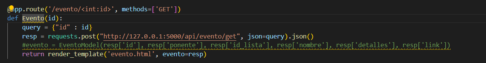

# Trabajo Final de Ingenieria de Software I: Pagina Web de eventos relacionados a computacion

## Proposito del Proyecto
Debido a los grandes avances y nuevas tecnologias relevantes para la sociedad de computacion que comprende entre investigadores, profesores, empresas, estudiantes y demas personas aficionados; esta pagina web pretende ser util para que los ponentes puedan notificar de sus proximos eventos a traves de una interfaz simple, y asi estos puedan mostrar mas interes a los temas tratados y agrandar la comunidad de ciencia de la computacion.

## Funcionalidades
La pagina web presenta entre sus principales funcionalidades:

### - Visualizar a traves de una interfaz grafica eventos relacionados a la computacion

### - Obtener mas informacion de los eventos

### - Acceder a los perfiles de los ponentes

### - Interaccion a traves de sesiones

## Refactoring  
### Funcion Evento  

