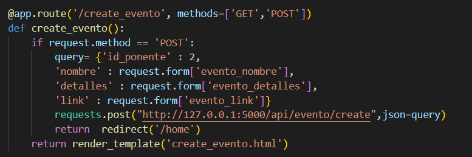

# Trabajo Final de Ingenieria de Software I: Pagina Web de eventos relacionados a computacion

## Proposito del Proyecto
Debido a los grandes avances y nuevas tecnologias relevantes para la sociedad de computacion que comprende entre investigadores, profesores, empresas, estudiantes y demas personas aficionados; esta pagina web pretende ser util para que los ponentes puedan notificar de sus proximos eventos a traves de una interfaz simple, y asi estos puedan mostrar mas interes a los temas tratados y agrandar la comunidad de ciencia de la computacion.

## Refactoring
se encontro el codigo en este estado

Segun SonarLint

Se hizo refactoring

## Nueva funcionalidad

Se creo la funcionalidad para crear eventos

## Pruebas unitarias
Para las pruebas unitarias se ha utilizado la librería de unittest

## Pruebas funcionales
Para las pruebas funcionales se ha hecho uso de selenium

Y el resultado seria  

