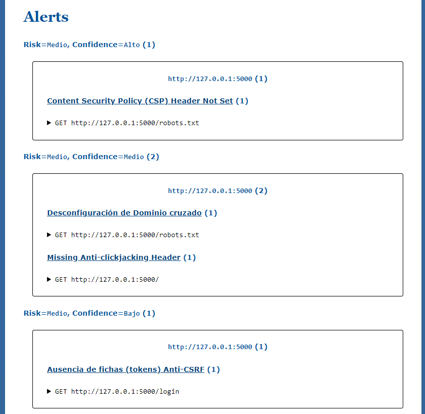
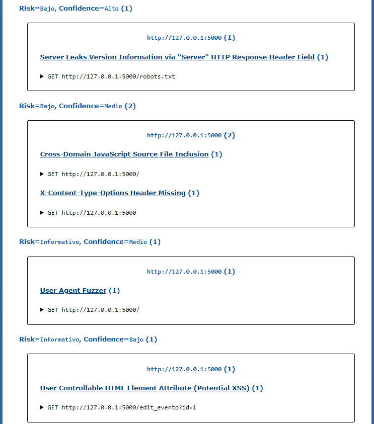
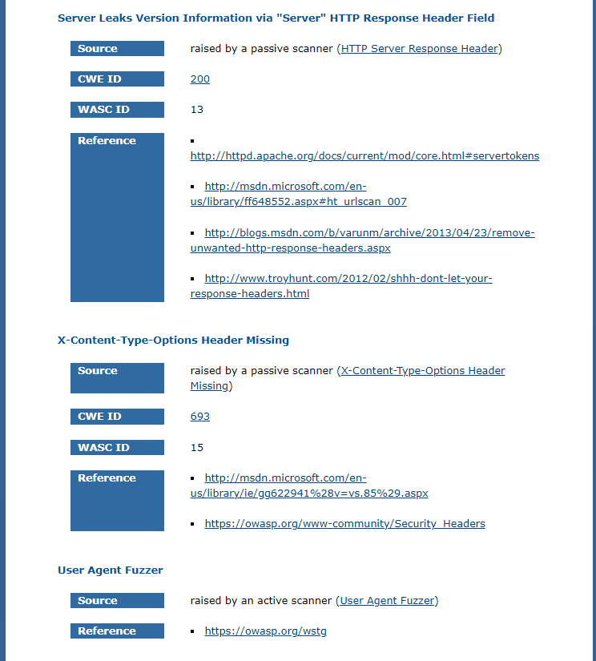

# Trabajo Final de Ingenieria de Software II: Pagina Web de eventos relacionados a computacion

## Proposito del Proyecto
Debido a los grandes avances y nuevas tecnologias relevantes para la sociedad de computacion que comprende entre investigadores, profesores, empresas, estudiantes y demas personas aficionados; esta pagina web pretende ser util para que los ponentes puedan notificar de sus proximos eventos a traves de una interfaz simple, y asi estos puedan mostrar mas interes a los temas tratados y agrandar la comunidad de ciencia de la computacion.

## Herramientas

-GitHub: Usamos este tipo de herramienta para crear un repositorio donde alojar nuestro proyecto. 
-JMeter 
-SonarQube: Es una plataforma para evaluar código fuente. Es software libre y usa diversas herramientas de análisis estático de código fuente como Checkstyle, PMD o FindBugs para obtener métricas que pueden ayudar a mejorar la calidad del código de un programa. 
-Sonar-scanner  
-JUnit: Es un conjunto de bibliotecas son utilizadas en programación para hacer pruebas unitarias de aplicaciones Java.JUnit es el estándar de facto para las pruebas unitarias de una aplicación Java. Aunque, es popular para las pruebas unitarias, tiene soporte completo y provisión para pruebas de instrumentación también.  
-OWASP ZAP  
-Selenium: Es un entorno de pruebas de software para aplicaciones basadas en la web. Selenium provee una herramienta de grabar/reproducir para crear pruebas sin usar un lenguaje de scripting para pruebas.  

### - Obtener mas informacion de los eventos

### - Acceder a los perfiles de los ponentes

### - Interaccion a traves de sesiones

## Github
Se ha utilizado como repositorio fuente ... sobre el cual se ha trabajo.  
Cada integrante ha creado su propia rama con su nombre sobre la cual ha trabajado y se ha realizado integracion continua sobre la rama de **desarrollo** en la cual se realizan las diferentes pruebas tanto unitarias, funcionales, de rendimiento, de seguridad y el analisis estatico.

## Pipeline en Jenkins
Para realizar el procedimiento completo de integración continua es necesario trabajar con Jenkins. Por ello se ha creado un pipeline con el siguiente script

## Construcción automática
En Python el tema de construcción automática no necesita de comandos específicos, 
## Analisis Estático
## Pruebas unitarias
Para las pruebas unitarias se ha utilizado la librería de unittest
## Pruebas funcionales
Para las pruebas funcionales se ha hecho uso de selenium
## Pruebas de seguridad
Para la pruebas de seguridad se ha hecho uso de Owasp zap
# Contenidos
 

##Sobre el reporte
 

##Sumario

 
 
 

##Apendice

 

## Pruebas de rendimiento
## Requisitos

- Jmeter
- Paths (JMeter, Proyecto, Output y URL)

Para esta sección usaremos la herramienta JMeter para hacer las pruebas de rendimiento en el proyecto. 

Iniciamos un plan de pruebas, con grupos de hilos y su respectivo HTTP.

Al finalizar generar un HTTP report del proyecto en JMeter, el cual nos dara un informe completo de este. 

## Gestion de issues
La gestion de Issues se ha realizado directamente en Github. 
