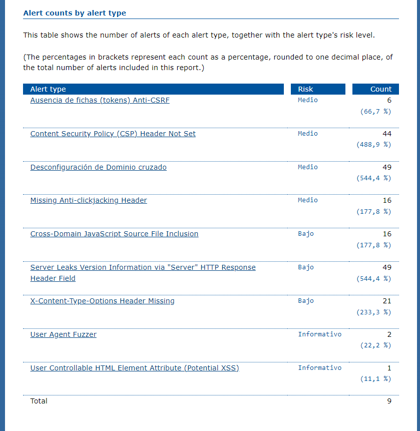
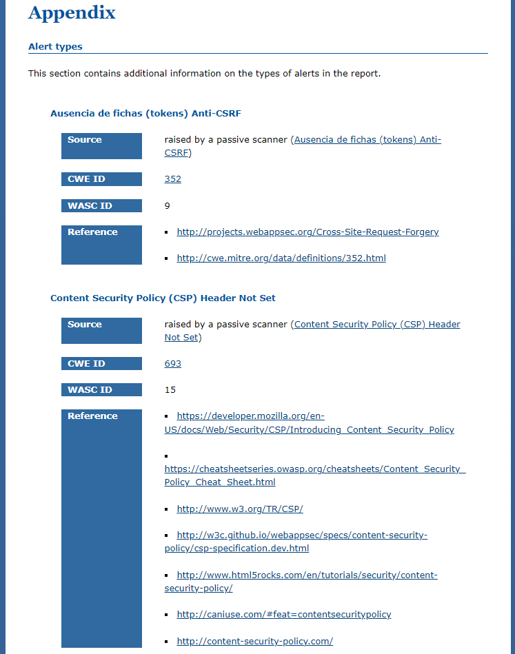

# Trabajo Final de Ingenieria de Software I: Pagina Web de eventos relacionados a computacion

## Proposito del Proyecto
Debido a los grandes avances y nuevas tecnologias relevantes para la sociedad de computacion que comprende entre investigadores, profesores, empresas, estudiantes y demas personas aficionados; esta pagina web pretende ser util para que los ponentes puedan notificar de sus proximos eventos a traves de una interfaz simple, y asi estos puedan mostrar mas interes a los temas tratados y agrandar la comunidad de ciencia de la computacion.

## Funcionalidades
La pagina web presenta entre sus principales funcionalidades:

### - Visualizar a traves de una interfaz grafica eventos relacionados a la computacion

### - Obtener mas informacion de los eventos

### - Acceder a los perfiles de los ponentes

### - Interaccion a traves de sesiones

## Github
Se ha utilizado como repositorio fuente ... sobre el cual se ha trabajo.  
Cada integrante ha creado su propia rama con su nombre sobre la cual ha trabajado y se ha realizado integracion continua sobre la rama de **desarrollo** en la cual se realizan las diferentes pruebas tanto unitarias, funcionales, de rendimiento, de seguridad y el analisis estatico.

## Pipeline en Jenkins
Para realizar el procedimiento completo de integración continua es necesario trabajar con Jenkins. Por ello se ha creado un pipeline con el siguiente script

## Construcción automática
En Python el tema de construcción automática no necesita de comandos específicos, 
## Analisis Estático
## Pruebas unitarias
Para las pruebas unitarias se ha utilizado la librería de unittest
## Pruebas funcionales
Para las pruebas funcionales se ha hecho uso de selenium
## Pruebas de seguridad
Para la pruebas de seguridad se ha hecho uso de Owasp zap
# Contenidos
 

##Sobre el reporte
 

##Sumario

 
 
 

##Apendice

 

## Pruebas de rendimiento
Para las pruebas de rendimiento se ha hecho uso de JMeter
## Gestion de issues
La gestion de Issues se ha realizado directamente en Github. 
